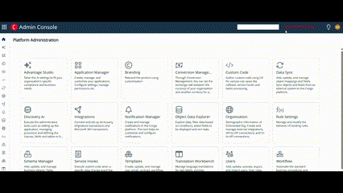

# Conga Platform Chrome Extension

The Conga Platform Extension is a Chrome Extension designed to enhance productivity for developers working with the Conga Platform. It provides quick utilities for auth token copy, quick redirection and easy data handling (import/export).

**Features:**

1) Copy user authentication token

* The option is available on conga platform page by hovering over the org name displayed via extension

2) Generate GUID

* Clicking this will prompt you to provide salesforce Id, helping you find the Platform ID of any master data synced from Salesforce to Conga Platform. This eliminates the need to query the platform using External IDs just to retrieve the Platform Id of the record.

3) Compare Salesforce record

* You can compare record from salesforce page in a split view to compare the record details between salesforce and Conga platform. This will help see values on same page from both platforms and records can be updated during testing.
* Once the split view is open it will automatically try to detect the record change on the tab and open the record details in split view as the user navigates through records.

https://github.com/user-attachments/assets/5c03ba6a-5a00-4165-83c1-9f9b57e70374

